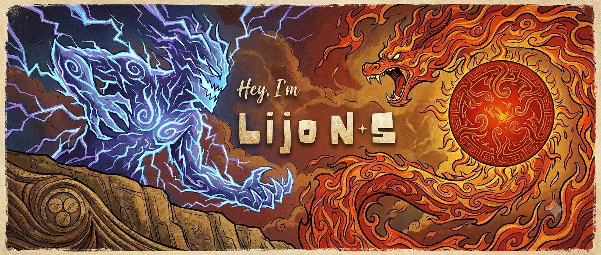

<div align="center">



</div>

---
```typescript
const lijo = {
  role: "Full Stack Developer",
  currently: "Building real products",
  superpowers: [
    "End-to-end ownership",
    "Real-time systems",
    "Payment integrations",
    // and few more...
  ],
};
```

[](https://www.linkedin.com/in/lijo-ns/)
[](https://medium.com/@lijons13)
[](https://leetcode.com/u/lijons/)
[](mailto:lijons13@gmail.com)


<br clear="right"/>


<div align="center">

**Got something interesting to build?**

[](https://www.linkedin.com/in/lijo-ns/)
[](mailto:lijons13@gmail.com)


</div>
